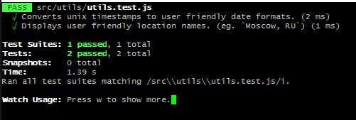

### `demo @ ` [palmhr/weatherapp](https://nikolav-webdev.xyz)

---

### `$ yarn build`
  > bundles for production

### `$ yarn start`
  > starts dev server

### `$ yarn test`
  > runs test scripts
### `yarn run build:bs`
  > compiles bootstrap
  